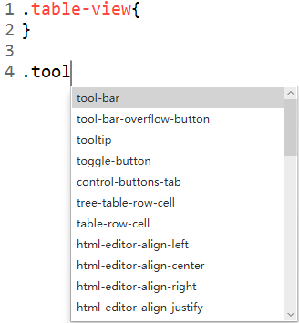

# CSS Editor FX #

A CSS editor written in JavaFX 8

## Features ##
- [Code Highlight](#highlight)
- [Code Assist](#suggest)
	- [JavaFX Context](#suggest-common)
	- [Current Context](#suggest-current)
	- *[Specify Context](#suggest-specify)*
- [Preview](#preview)
	- [Color](#color-preview)
		- [Color](#color-preview-color)
		- [Color Function](#color-preview-color-function)
		- [Gradient](#color-preview-gradient)
		- *[Context Color Paser](#color-preview-context)*
	- [Shape](#shape-preview)
- [Other Text Editor Common Features](#other)
	- *[Code Format](#format)*
	- [Toggle Comment](#comment)
	- [Custom Font](#font)
	- [Custom Shortcut](#shortcut)
- [Known Bugs](#bug)

## <a id="highlight"/> Code Highlight ##

## <a id="suggest"/> Code Assist ##
### <a id="suggest-common"/> JavaFX Context ###

### <a id="suggest-current"/> Current Context ###

### <a id="suggest-specify"/> Specify Context ###
*Not implement yet*

## <a id="preivew"/> Preview ##
### <a id="color-preview"/> Color ###
#### <a id="color-preview-color"/> RGB ####

#### <a id="color-preview-function"/> Function ####

#### <a id="color-preview-gradient"/> Gradient ####

#### <a id="color-preview-context"/> Context Color Paser ####

### <a id="shape-preview"/> Shape ###

## <a id="other"/> Other ##
### <a id="format"/> Code Format ###
*Not implement yet*
### <a id="comment"/> Toggle Comment ###

### <a id="font"/> Custom Font ###

### <a id="shortcut"/> Custom Shortcut ###

## <a id="bug"/> Known Bugs ##
- richtextfx codeArea undo leads IllegalArgumentException when merge changes. See [https://github.com/TomasMikula/RichTextFX/pull/402](https://github.com/TomasMikula/RichTextFX/pull/402 "github"), it may resolve soon.
- close tab will not correctly refresh currentTab property. It lead tab color and scrollbars still.